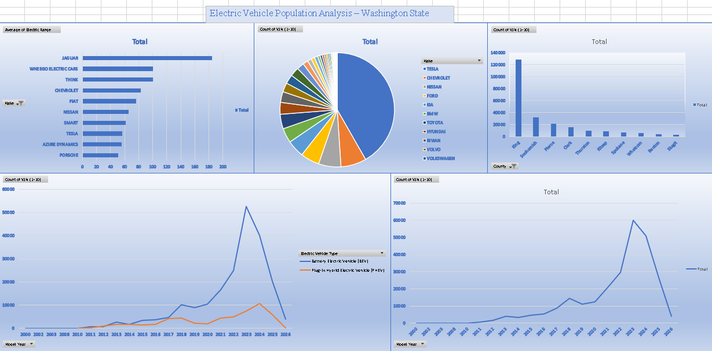

# Electric Vehicle Population Analysis 🚗⚡

This project analyzes the Electric Vehicle Population dataset (Washington State) using Microsoft Excel.

## Contents
- Data Cleaning (TRIM, PROPER, VLOOKUP, IFERROR)
- Feature Engineering (Full Model Name, Range Category)
- PivotTable Insights:
  1. Market share per brand
  2. Growth trend per year
  3. BEV vs PHEV adoption
  4. Average range per brand
  5. Top 10 counties
- Interactive Dashboard with slicers

## Dashboard Preview

## Tools
- Excel 365
- PivotTable, PivotChart
- Excel Functions: TRIM, CONCAT, LEFT, RIGHT, MID, VLOOKUP, IFERROR
